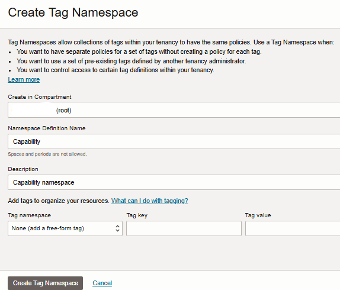
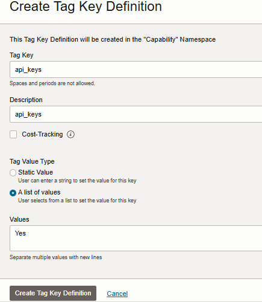
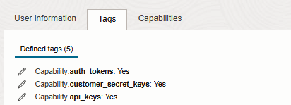

# Automate IAM User Capability Management

## Introduction
This is an automation solution to manage the Identity Domain User's capabilities.

## Prerequisites

### Create OCI Tag namespace

1. Open the **navigation menu** and click **Governance & Administration**. Under **Tenancy Management**, click **Tag Namespaces**.
2. A list of the tag namespaces in your current compartment is displayed.
3. On the **Tag Namespaces** page, click **Create Tag Namespaces**.
In the **Create Tag Namespace** panel, provide the following information:
- **Create in Compartment**: The compartment in which you want to create the namespace definition.
- **Namespace Definition Name**: A unique name for this set of tags. The name must be unique within your tenancy. Tag namespace is case insensitive. You cannot change this value later. Avoid entering confidential information.
- **Description**: A friendly description. You can change this value later if you want to.
4. Click **Create Tag Namespace**.




### Create Tag Key Definition
1. On the **Tag Namespaces** page, click the tag namespace you want to add the tag key definition to.
2. On the **Tag Namespace Details** page, in the **Tag Key Definitions** section, click **Create Tag Key Definition**.
3. In the **Create Tag Key Definition** panel, provide the following information:
- **Tag Key**: Enter the key. Value should be one of api_keys,console_password,auth_tokens,customer_secret_keys,db_credentials,o_auth2_client_credentials,smtp_credentials
- **Description**: Enter a friendly description.
- **Cost-tracking**: Select the check box to enable this tag for cost tracking. You can use up to 10 Cost-Tracking Tags in your tenancy.
4. In the Tag Value Type section, select one of the option of **A List of Values** and provide **Yes** in the **Values** section
5. Click **Create Tag Key Definition**.
6. Follow above steps to create tag key definition for rest of the capabilities.



### Add tags to the user
#### To the existing user
1. Open the **navigation menu** and click **Identity & Security**. Under **Identity**, click **Domains**.
2. A list of the domains in your current compartment is displayed.
3. Select the Domain and click on the **Users**.
4. Find and click the user you want to add the tag.
5. Under the **More Actions** menu click on **Add Tags**
6. In the **Add Tags** dialog:
- Select the **Tag Namespace**.
- Select the **Tag Key**.
- In Value, select one from the list.
- To apply another tag, click **Add Tag**.
- When finished adding tags, click **Add Tags**.

#### To the new user
1. Add Tags from the **Show advance options** while creating a new user.


> Add tags for all those capabilities for which you want the capabilities enabled.

### Create and deploy OCI function
1. On **OCI console**, click **Cloud Shell** in the top navigation.
2. Create **function** using Fn project CLI from cloud shell.
```
fn init --runtime python <function-name>

Example: fn init --runtime python expiry-notification-func
Change directory to the newly created directory.
```
3. Create **app** to deploy the function.
```
# Specify the OCID of subnet

fn create app my-function-application --annotation oracle.com/oci/subnetIds='["<subnet OCID>"]'

Example:  fn create app my-function-application --annotation oracle.com/oci/subnetIds='["ocid1.subnet.oc1.ap-mumbai-1.aaaaaaaabitp32dkyXXXXX2nxivwb....."]'
```
4. Copy and paste content of **func.py** from this repo and overwriting the existing content.
6. Update config parameters in **func.yaml** file.

- domain_ocids : required only for bulk mode or running on targeted domains.
- execution_mode : supported values are - enable/disable/enable and disable
- manage_capability : valid values are - api_keys,auth_tokens,console_password,customer_secret_keys,db_credentials,o_auth2_client_credentials,smtp_credentials. Exclude a capability if it need not to be managed with the solution.
- tag_namespace : name of the tag namespace

7. Run below command to **deploy the function**.
```
fn -v deploy --app <app-name>

Example: fn -v deploy --app my-function-application
```
## Create Schedule in Resource Scheduler
1. Open the **navigation menu** and click **Governance & Administration**.
2. Under **Resource Scheduler**, click **Schedules**.
3. Under **Create a Schedule**, click Create a Schedule. The Create a schedule dialog box opens.
4. Fill up schedule name, schedule description and action to be executed as **start** under basic information and click Next.
5. Under resources **select your function compartment** and function and click Next. 
6. Under schedule select **Daily** and configure **other parameters** as per your requirement.
7. In the **Repeat every field**, enter how often you would like the schedule to run or use the menu to select an interval. The minimum value is 1. The maximum value is 99.
8. In the **Start Time** field, enter the time in hours and minutes in 24-hour format.
9. Click **Next** to go to the **Review** and **Create Schedule**.
10. This will run your function on a scheduled interval

## Create Event rule
1. Open the **navigation menu** and click **Observability & Management**. Under **Events Service**, click **Rules**.
2. Select the root compartment.
3. Click **Create Rule**.
4. Provide **Display Name** and **Description**.
5. Select **Event Type** in **Condtion**.
6. select **Identity** in **Service Name**.
7. select **User-Create** in **Event Type**.
8. Select **Functions** in **Action Type**.
9. Select the function.
10. Click **Create Rule**.
11. This will invoke the function when any new user gets created.

## License
Copyright (c) 2024 Oracle and/or its affiliates.

Licensed under the Universal Permissive License (UPL), Version 1.0.

See [LICENSE](LICENSE) for more details.

ORACLE AND ITS AFFILIATES DO NOT PROVIDE ANY WARRANTY WHATSOEVER, EXPRESS OR IMPLIED, FOR ANY SOFTWARE, MATERIAL OR CONTENT OF ANY KIND CONTAINED OR PRODUCED WITHIN THIS REPOSITORY, AND IN PARTICULAR SPECIFICALLY DISCLAIM ANY AND ALL IMPLIED WARRANTIES OF TITLE, NON-INFRINGEMENT, MERCHANTABILITY, AND FITNESS FOR A PARTICULAR PURPOSE.  FURTHERMORE, ORACLE AND ITS AFFILIATES DO NOT REPRESENT THAT ANY CUSTOMARY SECURITY REVIEW HAS BEEN PERFORMED WITH RESPECT TO ANY SOFTWARE, MATERIAL OR CONTENT CONTAINED OR PRODUCED WITHIN THIS REPOSITORY. IN ADDITION, AND WITHOUT LIMITING THE FOREGOING, THIRD PARTIES MAY HAVE POSTED SOFTWARE, MATERIAL OR CONTENT TO THIS REPOSITORY WITHOUT ANY REVIEW. USE AT YOUR OWN RISK.